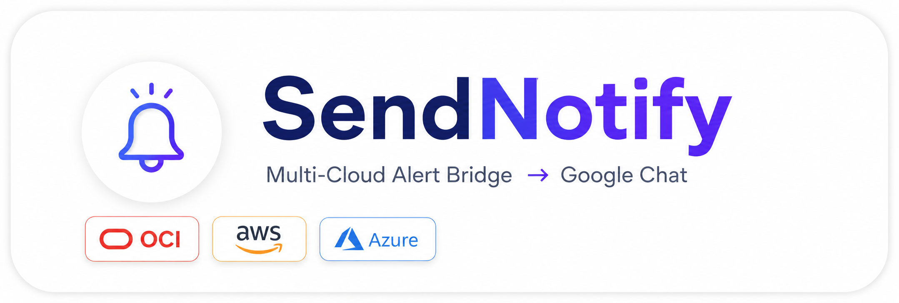

<div align="center">



</div>

[](https://python.org)
[](https://flask.palletsprojects.com)
[](https://docker.com)
[](https://kubernetes.io)
[](https://oracle.com/cloud)
[](https://aws.amazon.com)
[](https://azure.microsoft.com)
[](https://chat.google.com)
[](LICENSE)

# 📨 SendNotify

**Send Notify** é um webhook bridge **multi-cloud** que recebe alertas de **OCI Monitoring**, **AWS CloudWatch** e **Azure Monitor** e os encaminha para o **Google Chat**.

A aplicação **detecta automaticamente** qual nuvem enviou o alerta, normaliza o payload e formata a mensagem com emojis e estrutura adequada para cada status (`FIRING` / `RESOLVED`).

---

## Sumário

- [🎯 Visão Geral](#-visão-geral)
- [⚙️ Funcionalidades](#️-funcionalidades)
- [🏗️ Fluxo](#️-fluxo)
- [📁 Estrutura do Projeto](#-estrutura-do-projeto)
- [💻 Pré-requisitos](#-pré-requisitos)
- [🚀 Testar Localmente (passo a passo)](#-testar-localmente-passo-a-passo)
- [☁️ Providers](#️-providers)
  - [OCI Monitoring](#oci-monitoring)
  - [AWS CloudWatch](#aws-cloudwatch)
  - [Azure Monitor](#azure-monitor)
- [🐳 Testar com Docker](#-testar-com-docker)
- [☸️ Deploy no Kubernetes](#️-deploy-no-kubernetes)
- [🧪 Testar com Mocks](#-testar-com-mocks)
- [🛠️ Troubleshooting](#️-troubleshooting)
- [📬 Endpoints](#-endpoints)

---

## 🎯 Visão Geral

**Send Notify** é um webhook bridge **multi-cloud** que recebe alertas de **OCI Monitoring**, **AWS CloudWatch** e **Azure Monitor** e os encaminha para o **Google Chat**.

A aplicação **detecta automaticamente** qual nuvem enviou o alerta, normaliza o payload e formata a mensagem com emojis e estrutura adequada para cada status (`FIRING` / `RESOLVED`).

<div align="right">

**[⬆️ Voltar ao topo](#-sendnotify)**

</div>

---

## ⚙️ Funcionalidades

| Funcionalidade | Status |
|---|---|
| Suporte OCI Monitoring | ✅ |
| Suporte AWS CloudWatch (via SNS) | ✅ |
| Suporte Azure Monitor | ✅ |
| Auto-detect do provider pelo payload | ✅ |
| Confirmação automática de subscription | ✅ |
| Autenticação Basic Auth via Secret | ✅ |
| Health check (/health) | ✅ |
| Endpoint de teste (/send) | ✅ |
| Probes Kubernetes (liveness + readiness) | ✅ |
| Node affinity para nós services | ✅ |
| Testes offline com mocks | ✅ |
| Pronto para Docker | ✅ |

<div align="right">

**[⬆️ Voltar ao topo](#-sendnotify)**

</div>

---

## 🏗️ Fluxo

```
┌──────────────┐     ┌──────────┐     ┌──────────────────┐     ┌──────────────┐
│  OCI / AWS   │ ──▶ │  Tópico  │ ──▶ │  Subscription    │ ──▶ │  Google Chat │
│  / Azure     │     │ (SNS)    │     │  HTTP → esta app │     │  (Webhook)   │
└──────────────┘     └──────────┘     └──────────────────┘     └──────────────┘
                                              │
                                        ┌─────┴─────┐
                                        │  detect() │ ← identifica OCI / AWS / Azure
                                        ├───────────┤
                                        │ normalize │ ← traduz para formato único
                                        └─────┬─────┘
                                              │
                                   ┌──────────┴──────────┐
                                   │                     │
                            ├─ confirmation_url    ── sem título
                            │   → GET na URL        → 400
                            │   → "Subscription
                            │     confirmed"
                                   │
                            ── envia para o Google Chat
```

<div align="right">

**[⬆️ Voltar ao topo](#-sendnotify)**

</div>

---

## 📁 Estrutura do Projeto

```
sendnotify/
│
├── build/                          # Código fonte e imagem
│   ├── main.py                     # App Flask (endpoints /subscription, /send, /health)
│   ├── wsgi.py                     # Entrypoint para gunicorn
│   ├── app.py                      # Atalho para python app.py
│   ├── requirements.txt            # Dependências
│   ├── Dockerfile                  # Imagem Docker (python:3.10-alpine)
│   │
│   ├── providers/                  # Normalizadores multi-cloud
│   │   ├── __init__.py             # Registry + auto-detect
│   │   ├── oci.py                  # OCI Monitoring
│   │   ├── aws.py                  # AWS CloudWatch via SNS
│   │   └── azure.py                # Azure Monitor
│   │
│   └── tests/                      # Testes com mocks offline
│       ├── test_providers.py       # Script de validação
│       └── samples/                # 8 payloads mock de exemplo
│
├── artifacts/                      # Manifestos Kubernetes
│   ├── 01-sendnotify-rbac.yaml       # ServiceAccount + ClusterRole + Binding
│   ├── 02-sendnotify-configmap.yaml  # TZ, CLOUD, CLOUDID
│   ├── 03-sendnotify-secret.yaml     # Template da Secret (NÃO commit com creds reais)
│   ├── 04-sendnotify-service.yaml    # Service (headless)
│   ├── 05-sendnotify-deployment.yaml # Deployment com probes + affinity
│   └── 06-sendnotify-ingress.yaml    # Ingress com TLS
│
├── .gitignore
└── README.md
```

<div align="right">

**[⬆️ Voltar ao topo](#-sendnotify)**

</div>

---

## 💻 Pré-requisitos

- **Python 3.10+**
- **curl**
- **Docker** (opcional, para teste com container)
- **kubectl** (opcional, para deploy no Kubernetes)
- Um **webhook do Google Chat** ([como criar](https://developers.google.com/chat/how-tos/webhooks))

<div align="right">

**[⬆️ Voltar ao topo](#-sendnotify)**

</div>

---

## 🚀 Testar Localmente (passo a passo)

> Instruções para quem nunca usou Python.

### 1. Clone o repositório

```bash
cd /caminho/do/sendnotify
```

### 2. Crie o ambiente virtual

IsoIa as dependências do projeto:

```bash
python3 -m venv .venv
source .venv/bin/activate
```

Você verá `(.venv)` no início do terminal.

### 3. Instale as dependências

```bash
pip install -r build/requirements.txt
```

### 4. Configure as variáveis de ambiente

```bash
export AUTH_admin=secret
export AUTH_user=password
export WEBHOOK='https://chat.googleapis.com/v1/spaces/SEU_SPACE/messages?key=SEU_KEY&token=SEU_TOKEN'
export CLOUDID=MinhaEmpresa
```

> 💡 **Dica**: crie um arquivo `.env` (não versionado) para não digitar toda vez:
>
> ```bash
> cat > .env << 'EOF'
> export AUTH_admin=secret
> export AUTH_user=password
> export WEBHOOK='URL_DO_WEBHOOK'
> export CLOUDID=MinhaEmpresa
> EOF
> source .env
> ```

### 5. Inicie a aplicação

```bash
python build/main.py
```

Saída esperada:

```
 * Running on all addresses (0.0.0.0)
 * Running on http://127.0.0.1:8080
```

**Deixe este terminal aberto.** Abra outro para os testes.

### 6. Teste o health check

```bash
curl http://localhost:8080/health
```

```json
{"status": "ok"}
```

### 7. Envie uma mensagem de teste

```bash
curl -X POST -u admin:secret \
  -H "Content-Type: application/json" \
  -d '{"text":"🧪 Teste via /send"}' \
  http://localhost:8080/send
```

```json
{
  "chat_message_id": "spaces/SEU_SPACE/messages/ID_UNICO",
  "message": "enviado"
}
```

### 8. Pare a aplicação

Pressione `Ctrl + C` no terminal da app.

<div align="right">

**[⬆️ Voltar ao topo](#-sendnotify)**

</div>

---

## ☁️ Providers

### OCI Monitoring

<details>
<summary>📋 Confirmação de subscription</summary>

```bash
curl -X POST -u admin:secret -H "Content-Type: application/json" \
  -d '{"ConfirmationURL": "https://httpbin.org/get"}' \
  http://localhost:8080/subscription
```
</details>

<details>
<summary>🔥 Alarme FIRING</summary>

```bash
curl -X POST -u admin:secret -H "Content-Type: application/json" \
  -d '{
    "title": "CPU Alta",
    "severity": "CRITICAL",
    "alarmMetaData": [{
      "status": "FIRING",
      "namespace": "oci_computeagent",
      "query": "CpuUtilization > 90",
      "alarmSummary": "CPU acima de 90%",
      "metricValues": [95.2]
    }]
  }' \
  http://localhost:8080/subscription
```
</details>

<details>
<summary>✅ Alarme RESOLVED</summary>

```bash
curl -X POST -u admin:secret -H "Content-Type: application/json" \
  -d '{
    "title": "CPU Alta",
    "severity": "CRITICAL",
    "alarmMetaData": [{
      "status": "OK",
      "namespace": "oci_computeagent",
      "query": "CpuUtilization > 90",
      "alarmSummary": "CPU normalizada",
      "metricValues": [45.0]
    }]
  }' \
  http://localhost:8080/subscription
```
</details>

### AWS CloudWatch

<details>
<summary>📋 Confirmação de subscription</summary>

```bash
curl -X POST -u admin:secret -H "Content-Type: application/json" \
  -d '{
    "Type": "SubscriptionConfirmation",
    "SubscribeURL": "https://sns.us-east-1.amazonaws.com/confirm?Token=abc"
  }' \
  http://localhost:8080/subscription
```
</details>

<details>
<summary>🔥 Alarme disparando (ALARM → FIRING)</summary>

```bash
curl -X POST -u admin:secret -H "Content-Type: application/json" \
  -d '{
    "Type": "Notification",
    "Message": "{\"AlarmName\":\"CPU Alta\",\"NewStateValue\":\"ALARM\",\"Region\":\"us-east-1\",\"AWSAccountId\":\"123456\",\"NewStateReason\":\"Threshold Crossed\",\"Trigger\":{\"MetricName\":\"CPUUtilization\",\"Threshold\":90}}"
  }' \
  http://localhost:8080/subscription
```
</details>

<details>
<summary>✅ Alarme resolvido (OK → RESOLVED)</summary>

```bash
curl -X POST -u admin:secret -H "Content-Type: application/json" \
  -d '{
    "Type": "Notification",
    "Message": "{\"AlarmName\":\"CPU Alta\",\"NewStateValue\":\"OK\",\"Region\":\"us-east-1\",\"AWSAccountId\":\"123456\",\"NewStateReason\":\"Threshold OK\",\"Trigger\":{\"MetricName\":\"CPUUtilization\",\"Threshold\":90}}"
  }' \
  http://localhost:8080/subscription
```
</details>

### Azure Monitor

<details>
<summary>🔥 Alarme disparando (Fired → FIRING)</summary>

```bash
curl -X POST -u admin:secret -H "Content-Type: application/json" \
  -d '{
    "data": {
      "essentials": {
        "alertRule": "CPU Alta",
        "severity": "Sev2",
        "monitorCondition": "Fired",
        "monitoringService": "Platform",
        "description": "CPU acima de 90%",
        "alertTargetIDs": ["/subscriptions/sub/resourceGroups/rg/providers/Microsoft.Compute/virtualMachines/vm01"]
      },
      "alertContext": {
        "condition": {"metricName": "Percentage CPU", "metricValue": "95.3"}
      }
    }
  }' \
  http://localhost:8080/subscription
```
</details>

<details>
<summary>✅ Alarme resolvido (Resolved → RESOLVED)</summary>

```bash
curl -X POST -u admin:secret -H "Content-Type: application/json" \
  -d '{
    "data": {
      "essentials": {
        "alertRule": "CPU Alta",
        "severity": "Sev2",
        "monitorCondition": "Resolved",
        "monitoringService": "Platform",
        "description": "CPU normalizada",
        "alertTargetIDs": ["/subscriptions/sub/resourceGroups/rg/providers/Microsoft.Compute/virtualMachines/vm01"]
      },
      "alertContext": {
        "condition": {"metricName": "Percentage CPU", "metricValue": "45.0"}
      }
    }
  }' \
  http://localhost:8080/subscription
```
</details>

<div align="right">

**[⬆️ Voltar ao topo](#-sendnotify)**

</div>

---

## 🐳 Testar com Docker

```bash
# Build
docker build -t send-notify build/

# Run
docker run --rm -p 8080:8080 \
  -e AUTH_admin=secret \
  -e AUTH_user=password \
  -e WEBHOOK='URL_DO_WEBHOOK' \
  -e CLOUDID=MinhaEmpresa \
  send-notify
```

```bash
# Testar (em outro terminal)
curl -X POST -u admin:secret \
  -H "Content-Type: application/json" \
  -d '{"text":"🧪 Teste via Docker"}' \
  http://localhost:8080/send
```

<div align="right">

**[⬆️ Voltar ao topo](#-sendnotify)**

</div>

---

## ☸️ Deploy no Kubernetes

### 1. Crie a Secret

```bash
kubectl create secret generic s-sendnotify \
  --from-literal=AUTH_ADMIN=seu_usuario \
  --from-literal=AUTH_USER=sua_senha \
  --from-literal=WEBHOOK='URL_DO_WEBHOOK' \
  --namespace=monitoring
```

> ⚠️ O arquivo `03-sendnotify-secret.yaml` é um **template**. Nunca commitar com credenciais reais.

### 2. Aplique os manifestos

```bash
kubectl apply -f artifacts/01-sendnotify-rbac.yaml
kubectl apply -f artifacts/02-sendnotify-configmap.yaml
kubectl apply -f artifacts/04-sendnotify-service.yaml
kubectl apply -f artifacts/05-sendnotify-deployment.yaml
kubectl apply -f artifacts/06-sendnotify-ingress.yaml
```

### 3. Verifique

```bash
kubectl get pods -n monitoring -l app=sendnotify
kubectl logs -n monitoring -l app=sendnotify --tail=50
```

<div align="right">

**[⬆️ Voltar ao topo](#-sendnotify)**

</div>

---

## 🧪 Testar com Mocks

Valida todos os normalizadores **sem precisar de webhook ou servidor rodando**:

```bash
python3 build/tests/test_providers.py
```

Saída esperada:

```
=== Detect ===
  ✓ todos os 8 payloads detectados corretamente

=== Normalize ===
  ✓ todos os status mapeados (FIRING / RESOLVED)

=== Unknown ===
  ✓ payload desconhecido retorna None

→ Todos os testes passaram!
```

Payloads de exemplo disponíveis em `build/tests/samples/`:

| Arquivo | Provider | Cenário |
|---|---|---|
| `oci-confirmation.json` | OCI | Confirmação |
| `oci-firing.json` | OCI | Disparando |
| `oci-resolved.json` | OCI | Resolvido |
| `aws-confirmation.json` | AWS | Confirmação |
| `aws-firing.json` | AWS | Disparando |
| `aws-resolved.json` | AWS | Resolvido |
| `azure-firing.json` | Azure | Disparando |
| `azure-resolved.json` | Azure | Resolvido |

<div align="right">

**[⬆️ Voltar ao topo](#-sendnotify)**

</div>

---

## 🛠️ Troubleshooting

### App retorna 200 mas mensagem não aparece no Google Chat

1. Teste o webhook direto (sem a app):
   ```bash
   curl -X POST -H "Content-Type: application/json" \
     -d '{"text":"teste"}' '$WEBHOOK'
   ```
   Se falhar, o webhook está inválido ou expirado.

2. Confira se o `spaces/ID` no webhook é o espaço correto.

3. Verifique os logs:
   ```bash
   tail -f /tmp/sendnotify.log
   ```
   Procure por `HTTP 200` na linha do Google Chat.

### Provider não detectado

Execute o script de mocks para validar o payload:

```bash
python3 build/tests/test_providers.py
```

Se o payload for de uma nuvem não suportada, será necessário [adicionar um novo provider](#-visão-geral).

### Pod no Kubernetes não inicia

```bash
kubectl describe pod -n monitoring -l app=sendnotify
kubectl logs -n monitoring -l app=sendnotify
```

Verifique se a Secret `s-sendnotify` existe:

```bash
kubectl get secret -n monitoring s-sendnotify
```

<div align="right">

**[⬆️ Voltar ao topo](#-sendnotify)**

</div>

---

## 📬 Endpoints

| Método | Rota | Autenticação | Descrição |
|---|---|---|---|
| `GET` | `/health` | ❌ | Health check para probes |
| `POST` | `/subscription` | ✅ Basic Auth | Webhook principal (alarmes) |
| `POST` | `/send` | ✅ Basic Auth | Envio de texto livre |

<div align="right">

**[⬆️ Voltar ao topo](#-sendnotify)**

</div>

---

<div align="center">

Feito com ☕ para simplificar alertas multi-cloud no Google Chat

</div>
